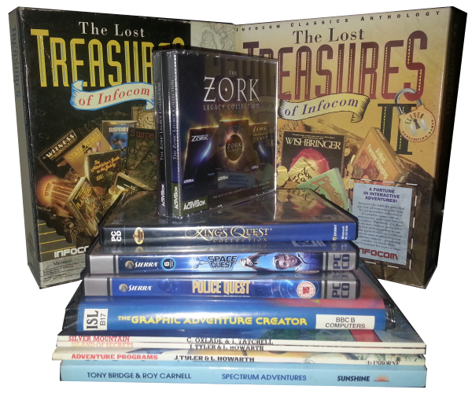
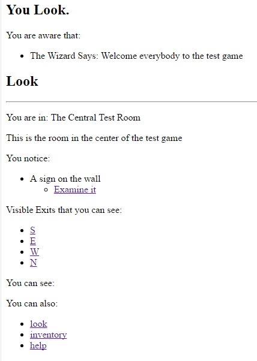
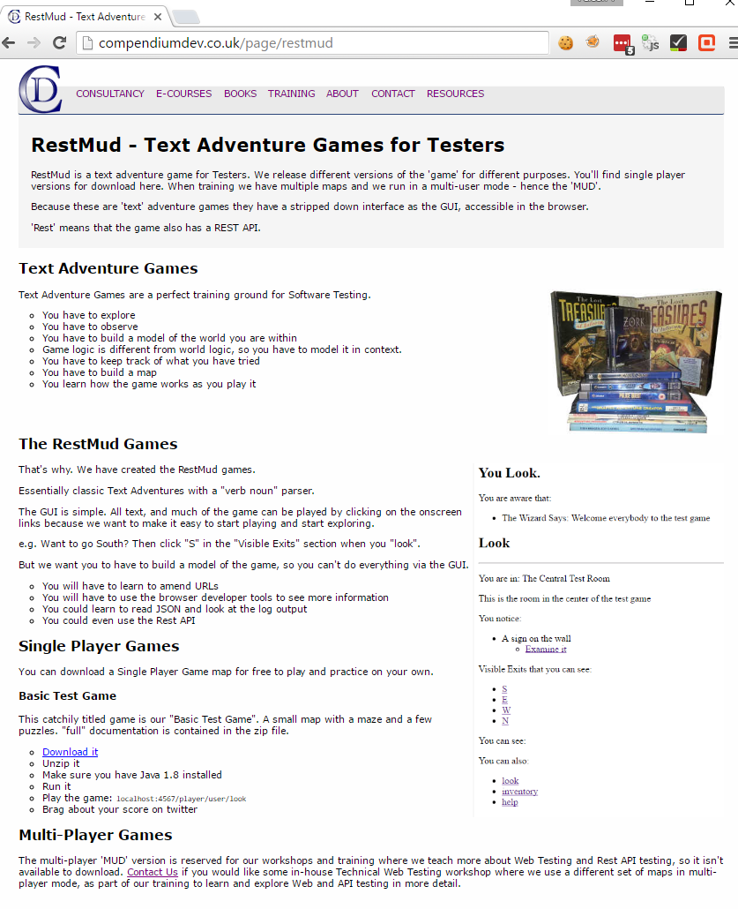
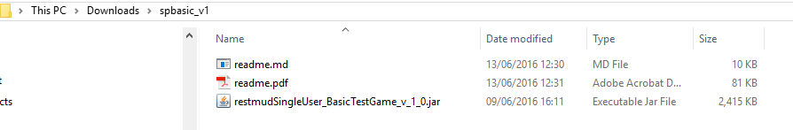
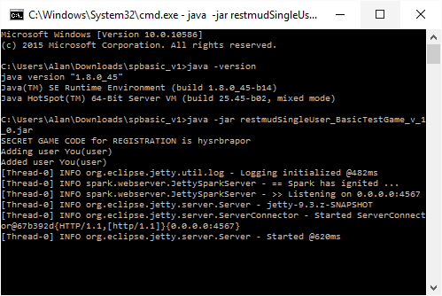
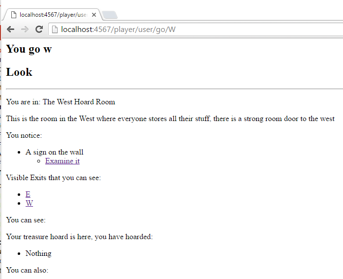
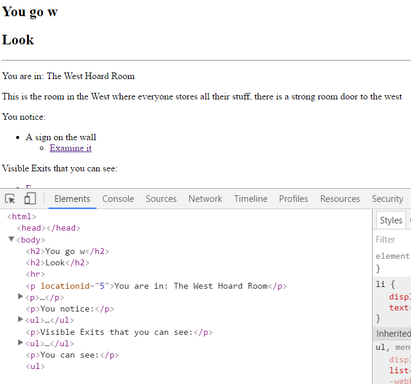
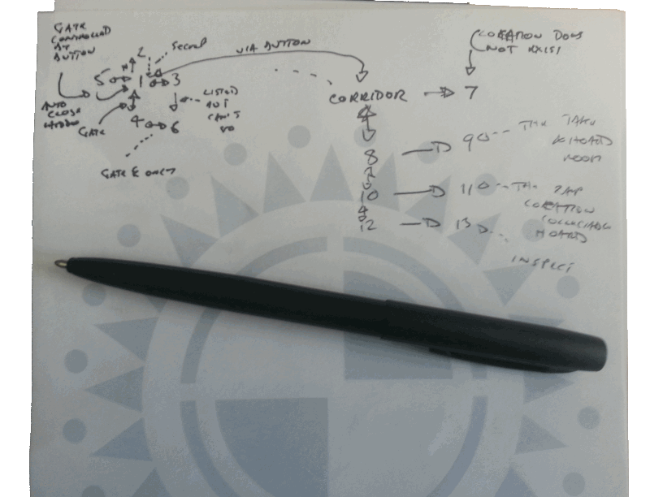
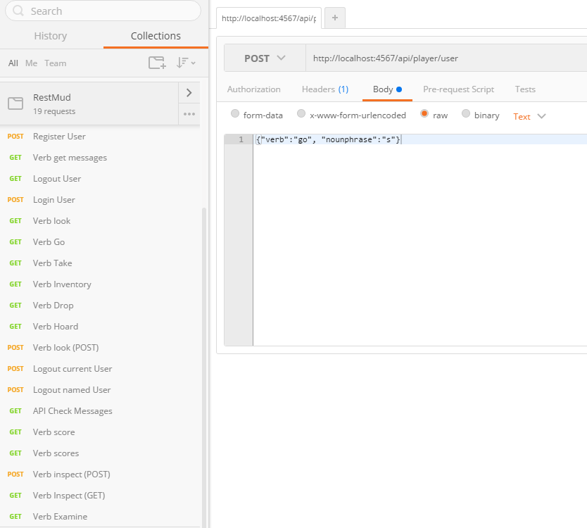
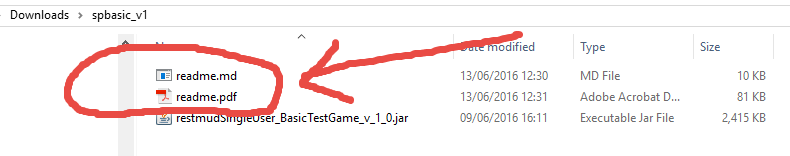

<!-- page_number: true -->
<!-- $theme: gaia
template: invert
-->

# RestMud – A Text Adventure Game For Testers

[compendiumdev.co.uk/page/restmud](http://compendiumdev.co.uk/page/restmud)

## … or anyone that wants to improve their web, browser dev tools, HTTP traffic, REST API skills 

---

# What is it?

---

# RESTMud is...

- A Browser Based Text Adventure Game
- A Rest Web Service
- An HTTP Server Application written in Java
- A challenge

---

# How Do I Play?

- Visit compendiumdev.co.uk/page/restmud

---

# How Do I Play?

- Download spbasic_v1.zip
- http://compendiumdev.co.uk//downloads/games/restmud/spbasic_v1.zip
- Unarchive the zip file
- Then ...

---

# How Do I Play?

- Ensure you have Java 1.8 installed
- Run the game 
- 'java -jar restmudSingleUser_BasicTestGame_v_1_0.jar'
- Visit… http://localhost:4567/player/user/look

---

# How Do I Play?

- Read the text
- Click on the links

e.g.

- To examine the sign, 
   - click “Examine it”
- To Go North,
   - Click “N”

---

# Easy

It is just a verb/noun text adventure game

e.g. 

- go north
- Examine sign
- Look
- Etc.

Well... not everything is displayed on the page…

You might have to… get a bit technical

---

# Pay Attention to the URLs

---
# Use the Browser Dev Tools

---

# Make a Map

---

# Use the API

---

# Read the Docs?

---

# How does it end?

- There is no death in this game.
- Did you escape the maze?
- Did you find any treasure?
- Did you hoard the treasure to keep it safe?
- Did you find secret passages?
- Different games have different puzzles

---

# Play the Game Now

#### http://compendiumdev.co.uk/page/restmud