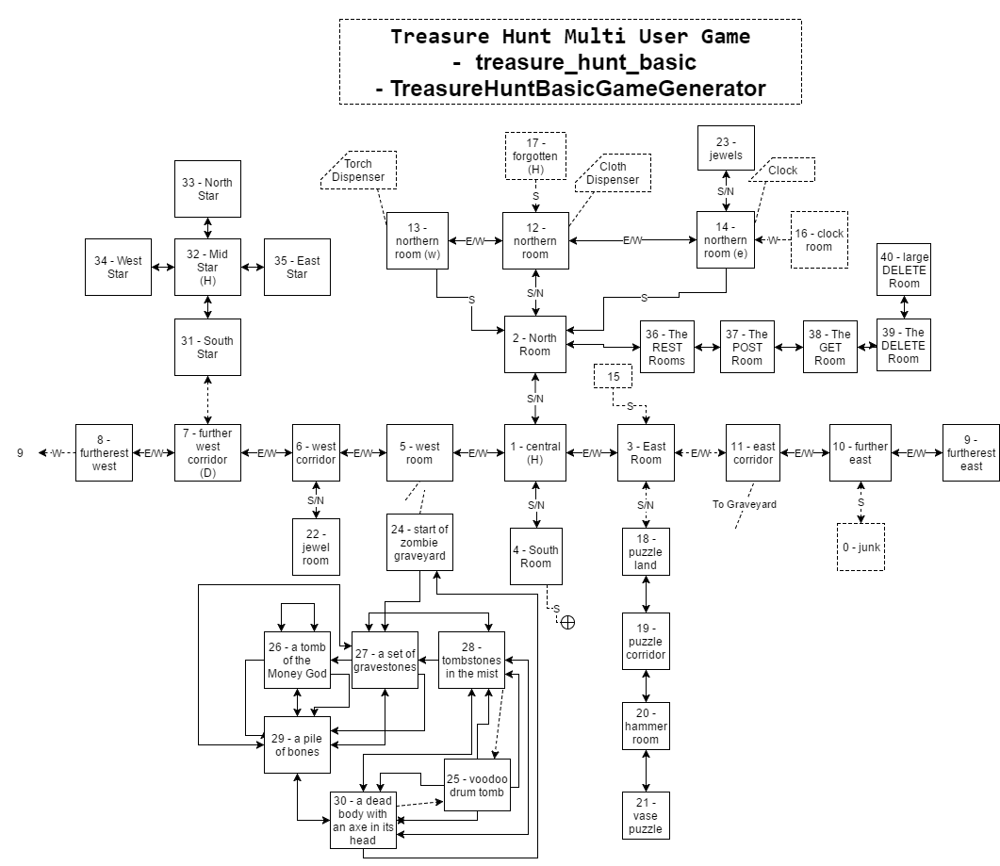

# Walkthrough and Hints for Treasure Hunt Multi User Game

## Warning

Using this game walkthrough will prevent you from investigating the game fully and learning what you can. Also note that I am not a professional hint and walkthrough writer so there is no guarantee that you an use this document without spoilage. I suggest you: read the hints first, dip into and out of the walkthrough, map your won map, only use the map here as a last resort.
This walkthrough is automatically generated from a 'test'. It is created as the game is played. So the output you see here is what the game provides, if you are doing something different then you are playing a different version of the game, a different game, or doing something wrong

## Hints

* read signs

## Walkthrough

 _we start in room 1_ 

`look `

> `You look.`

> `1` : `The Central Room`

> `This is the room in the center` 

> ... messages ...

* The Wizard Says: Welcome to the Treasure Hunt Adventure Game

### The Bomb Puzzle

`score `

> `Your Score is: 0`

 _I will solve the bomb puzzle_ 

`go n`

> `You go n`

> `2` : `The North Room`

> `This is the room in the north` 

> I can see some things here:

* `A sign on the wall` (`sign_1`)

> ... messages ...

* you can see a small round thing on the floor

`examine smallroundthing`

> `you look at the strange small round thing. it appears to have 'tick' written on it.`

> ... messages ...

* you can see a small round thing on the floor

`take smallroundthing`

> `you bend over and pick up the small round thing, you hear it go tock, and then tick, and then tick. and it keeps going 'tick' as though it is counting down to something. i wonder what it is. oh, by the way. the word 'bomb' is written on the other side.`

> ... messages ...

* the small round thing with the words 'tick' and 'bomb' is ticking loudly

 _I could just wait, but I'll get points if I defuse it_ 

`defuse smallroundthing`

> `you look at the strange small round thing, realise it is a bomb. and drawing on your years of experience with defusing bombs you throw it away in the hope that you will never see it again. you can't see it now, and you will probably never see it again.`

> ... messages ...

* you feel as though your score has increased.

`score `

> `Your Score is: 100`

### The Broken Transporter Puzzle

 _I will solve the broken transporter puzzle_ 

`go s`

> `You go s`

> `1` : `The Central Room`

`go s`

> `You go s`

> `4` : `The South Room`

> `This is the room in the South, there is a broken teleporter to the south` 

 _Yeah, it isn't a puzzle, it's just broken_ 

`go s`

> `you step into the broken transporter. <zap> <pfizz> 'ouch', that hurt you, and for no benefit. you are in the same room. the transporter is broken. i think there is another transporter around here somewhere`

> `4` : `The South Room`

### The Loose Stone Puzzle

 _I will solve the loose stone puzzle_ 

`go n`

> `You go n`

> `1` : `The Central Room`

`go w`

> `You go w`

> `5` : `The West Room`

> `This is the room in the West` 

> I can see some things here:

* `A rusted shut iron door to the south` (`rustedshutdoor`)

`go w`

> `You go w`

> `6` : `The West Corridor`

> `This is the eastern end of the western corridor in the West that continues West and East` 

> I can see some things here:

* `A helpful sign on the wall` (`sign_3`)
* `A loose stone on the floor` (`loosestone`)
* `A grotty forgettable sign on the wall` (`forgettablesign`)

 _I can't take the stone_ 

`take loosestone`

> `You tried to take: A loose stone on the floor but you can't take that`

 _But I can interact with it_ 

`examine loosestone`

> `You Examine: A loose stone on the floor ... Someone has carved something on the stone, it looks like it says 'lickforten'`

 _Seems unusual but, I'll try it_ 

`lick loosestone`

> `you lick the stone - bleurgh, that tasted funny, i wonder if everyone licks it. yuck. cooties. but you did gain 10 points on your score.`

 _Only lick it once_ 

`score `

> `Your Score is: 110`

### The Treasure Vase Puzzle

`go e`

> `You go e`

> `5` : `The West Room`

> I can see some things here:

* `A rusted shut iron door to the south` (`rustedshutdoor`)

`go e`

> `You go e`

> `1` : `The Central Room`

`go e`

> `You go e`

> `3` : `The East Room`

> `This is the room in the east` 

> I can see some things here:

* `A sign on the wall shaped like a question mark` (`puzzlelandsign`)

`examine puzzlelandsign`

> `You Examine: A sign on the wall shaped like a question mark ... To enter puzzle land you have to be able to say puzzle.`

`say puzzle`

> `you say 'puzzle' and a shimmery door opens to the south allowing you entry to puzzle land.`

 _Entering puzzland is a puzzle_ 

`score `

> `Your Score is: 210`

`go s`

> `you enter puzzle land.`

> `18` : `Puzzle Land Entrance`

> `This is the Entrance to Puzzle Land.` 

`go s`

> `You go s`

> `19` : `Puzzle Corridor`

> `The corridor of puzzles where each room offers new challenges, should you choose to chase a high score through your cleverness` 

`go s`

> `You go s`

> `20` : `Hammer Room`

> `This is a room with a hammer.` 

> I can see some things here:

* `A hammer chained to the floor` (`hammer`)

 _This is a simple monkey puzzle_ 

`go s`

> `You go s`

> `21` : `Vase Puzzle Room`

> `This is a room with whole bunch of vases (and treasure).` 

> I can see some things here:

* `A Sign On The Wall Of the Vase Puzzle Room` (`vasepuzzlesign`)

`take prizevase`

> `you look around and try to pick the best vase, but they all look the same, so you pick the first one that you find.`

`go n`

> `You go n`

> `20` : `Hammer Room`

> I can see some things here:

* `A hammer chained to the floor` (`hammer`)

`use hammer`

> `you use the hammer to smash the vase and your greedy eyes spy the treasure. you watch the treasure roll off to the side of the room and down a hole. what? such a disappointment. then you hear laughter and a voice says 'well done adventurer, you have scored some points'.`

 _Solved Puzzle, Get Score_ 

`score `

> `Your Score is: 310`

`go n`

> `You go n`

> `19` : `Puzzle Corridor`

`go n`

> `You go n`

> `18` : `Puzzle Land Entrance`

`go n`

> `You go n`

> `3` : `The East Room`

> I can see some things here:

* `A sign on the wall shaped like a question mark` (`puzzlelandsign`)

`go w`

> `You go w`

> `1` : `The Central Room`

### The Zombie Graveyard

`go w`

> `You go w`

> `5` : `The West Room`

> I can see some things here:

* `A rusted shut iron door to the south` (`rustedshutdoor`)

 _It looks like there is a room through there_ 

`examine rustedshutdoor`

> `You Examine: A rusted shut iron door to the south ... A heavy Iron door that has not been opened in a long time. It is rusted shut. And heavily barred. There is also a padlock. And the root is covered in chains. A sign on the door says 'do not enter under any circumstances, the graveyard is dangerous, the treasures here are not worth it, unless you are a Voodoo Master, in which case the Money God will rain treasure down upon you'. Looking through the bars on the door you can see a corridor that has not been used in a long time and beyond that, what looks like a rusty gate leading to a graveyard. You faintly hear something say 'brains'.`

I need to find a way in!

`go e`

> `You go e`

> `1` : `The Central Room`

`go e`

> `You go e`

> `3` : `The East Room`

> I can see some things here:

* `A sign on the wall shaped like a question mark` (`puzzlelandsign`)

 _Better Open The door!_ 

`open e`

> `OK, you open the door`

> `3` : `The East Room`

> I can see some things here:

* `A sign on the wall shaped like a question mark` (`puzzlelandsign`)

`go e`

> `You go e through the door`

> `11` : `The East Corridor`

> `This is the western end of the eastern corridor in the East` 

> I can see some things here:

* `A sign on the wall covered in blood` (`zombiemazesign`)

 _It looks like there is a clue on the sign_ 

`examine zombiemazesign`

> `You Examine: A sign on the wall covered in blood ... Say brains to enter the Zombie Graveyard maze where much treasure lies`

`say brains`

> `you say 'brains' and you hear a booming laugh. then you hear a loud drumming, everything goes dark and you are standing in a cold dark graveyard.`

> ... messages ...

* you heard moaning from the graveyard.

 _Where Am I?_ 

`look `

> `You look.`

> `24` : `The Start of The Zombie Graveyard`

> `You are at the start of the zombie graveyard you can see a gate to the North that is rusted shut and will not open, ever. The graveyard is misty but you can see a path heading South` 

> I can see some things here:

* `A dirty rock on the ground` (`dirtyrock`)
* `An immovable old rusty gate` (`rustygate`)

> ... messages ...

* you heard moaning from the graveyard.

`go s`

> `You go s`

> `27` : `A Set of Gravestones`

> `You are knee deep in mist in a Zombie Graveyard and can make out a set of gravestones` 

> I can see some things here:

* `A set of gravestones` (`gravestones`)

> ... messages ...

* you heard moaning from the graveyard.

`go w`

> `You go w`

> `26` : `A Tomb`

> `You are waist deep in mist in a Zombie Graveyard and can make out a tomb` 

> I can see some things here:

* `A Tomb` (`tomb`)

> ... messages ...

* you heard moaning from the graveyard.

 _Is this the tomb of The Money God?_ 

`examine tomb`

> `You Examine: A Tomb ... The tomb of the Money God. A sign above the tomb proclaims 'say moneygod' and treasure will fall, say it too often and once will be all.`

> ... messages ...

* you heard moaning from the graveyard.

 _Time for some magic_ 

`say moneygod`

> `you called upon the loa`

> ... messages ...

* wow, you have mighty vodou powers. you call upon the money god and treasure falls in the graveyard
* you heard moaning from the graveyard.

 _I better find a way to protect myself from zombies_ 

`look `

> `You look.`

> `26` : `A Tomb`

> I can see some things here:

* `A Tomb` (`tomb`)

> ... messages ...

* you heard moaning from the graveyard.

`go s`

> `You go s`

> `29` : `A Pile of Bones`

> `The mist is over your head and you can just see your feet, you are standing on a pile of bones` 

> I can see some things here:

* `A Pile Of Bones` (`pileofbones`)

> ... messages ...

* you heard moaning from the graveyard.

`go s`

> `You go s`

> `30` : `An Axe Incident`

> `The mist has cleared and you can see a shallow open grave with a dead body and an axe in its head` 

> I can see some things here:

* `An Axe In The Dead Body` (`axeindeadbody`)
* `A Dead Body` (`deadbody`)

> ... messages ...

* you heard moaning from the graveyard.

`examine axeindeadbody`

> `You Examine: An Axe In The Dead Body ... The axe has a wooden handle, and carved into the handle are the words 'Ash woz here' and say 'groovy'.`

`say groovy`

> `you say 'groovy', and you hear someone say 'shut those drums up, they are giving me a headache. you look around and see you are in a tomb, with a drum, and no-one with a headache`

> ... messages ...

* you heard an ominous silence. the graveyard is still. you feel something become aware of your presence.

`look `

> `You look.`

> `25` : `A Drummers Tomb`

> `You are in a tomb beside a drum` 

> ... messages ...

* you heard something moan. it sounded like it said 'brains'.

 _Zombies hate loud noises_ 

`use voodoodrum`

> `you called upon the loa`

> ... messages ...

* wow, you have mighty vodou powers. you can see zombies shuffling off into the darkness saying 'see ya, back soon'
* you heard moaning from the graveyard.

`go w`

> `You go w`

> `30` : `An Axe Incident`

> I can see some things here:

* `An Axe In The Dead Body` (`axeindeadbody`)
* `A Dead Body` (`deadbody`)

> ... messages ...

* you heard moaning from the graveyard.

`go s`

> `You go s`

> `24` : `The Start of The Zombie Graveyard`

> I can see some things here:

* `A dirty rock on the ground` (`dirtyrock`)
* `An immovable old rusty gate` (`rustygate`)

> ... messages ...

* you heard moaning from the graveyard.

 _How do I get out?_ 

`examine dirtyrock`

> `You Examine: A dirty rock on the ground ... The rock is actually an old broken slab, on the reverse is some writing and it reads: You can leave the maze if you say brains backwards.`

> ... messages ...

* you heard moaning from the graveyard.

 _I will leave this place now_ 

`say sniarb`

> `you say 'brains' backwards and you hear drums grow louder, the mist grows thicker and you see the hands of zombies reaching towards you, a zombie face snaps its jaws shut horribly close to your nose, darkness envelops you. and you are no longer in the graveyard. you check your nose. it is as noselike as it was before you entered the graveyard. but where are you?`

`look `

> `You look.`

> `2` : `The North Room`

> I can see some things here:

* `A sign on the wall` (`sign_1`)

### The Star Shaped Rooms

`go s`

> `You go s`

> `1` : `The Central Room`

`go w`

> `You go w`

> `5` : `The West Room`

> I can see some things here:

* `A rusted shut iron door to the south` (`rustedshutdoor`)

`go w`

> `You go w`

> `6` : `The West Corridor`

> I can see some things here:

* `A helpful sign on the wall` (`sign_3`)
* `A loose stone on the floor` (`loosestone`)
* `A grotty forgettable sign on the wall` (`forgettablesign`)

> ... messages ...

* the mighty money god will hear your prayers again.

`go w`

> `You go w`

> `7` : `The Further West Corridor`

> `It is too dark to see` 

 _Should I push the button?_ 

`examine starshapedbutton`

> `You Examine: A red star shaped button ... Red buttons are usually dangerous, I would not use that if I were you`

 _I will leave that for now_ 

`go w`

> `You go w`

> `8` : `The Furtherest West Corridor`

> `This is the western end of the western corridor in the West, it continues E, and a teleporter is to the West` 

> I can see some things here:

* `A direction sign on the wall` (`sign_2`)
* `A Voodoo Drum` (`voodoodrum`)

 _I will leave that for now_ 

`go w`

> `you walk west and realise you just stepped into a transporter. <zap> <pfizz> <twazzap>.`

> `9` : `The Furtherest East Corridor`

> `This is the eastern end of the eastern corridor in the East` 

> I can see some things here:

* `A red star shaped sign` (`starshapedsign`)
* `A Mega Cloth Dispenser` (`megaclothdispenser`)

`examine starshapedsign`

> `You Examine: A red star shaped sign ... The Sign Says: Red star shaped buttons are brilliant, I always use them and so should you`

 _I will push that button_ 

`go w`

> `You go w`

> `10` : `The Further East Corridor`

> `This is the middle of the eastern corridor in the East` 

`go w`

> `You go w`

> `11` : `The East Corridor`

> I can see some things here:

* `A sign on the wall covered in blood` (`zombiemazesign`)

`go w`

> `You go w through the door`

> `3` : `The East Room`

> I can see some things here:

* `A sign on the wall shaped like a question mark` (`puzzlelandsign`)

`go w`

> `You go w`

> `1` : `The Central Room`

`go w`

> `You go w`

> `5` : `The West Room`

> I can see some things here:

* `A rusted shut iron door to the south` (`rustedshutdoor`)

`go w`

> `You go w`

> `6` : `The West Corridor`

> I can see some things here:

* `A helpful sign on the wall` (`sign_3`)
* `A loose stone on the floor` (`loosestone`)
* `A grotty forgettable sign on the wall` (`forgettablesign`)

`go w`

> `You go w`

> `7` : `The Further West Corridor`

 _I will use that button_ 

`use starshapedbutton`

> `you press the button and a star shaped portal to the north appears, you walk through it because you can't help it.`

> `31` : `South Star`

> `The southern most room of star rooms` 

`go n`

> `You go n`

> `32` : `Mid Star`

> `The most central room of star rooms` 

`go n`

> `You go n`

> `33` : `North Star`

> `The most northern room of star rooms` 

> I can see some things here:

* `A sign on the wall` (`starsign`)

 _Shiny Treasure_ 

`take shinystar`

> `You took: shinystar. You now have the A valuable shiny star `

`go s`

> `You go s`

> `32` : `Mid Star`

`hoard shinystar`

> `You hoarded: shinystar [scored 200]`

`go n`

> `You go n`

> `33` : `North Star`

> I can see some things here:

* `A sign on the wall` (`starsign`)

 _I wonder if there is any more treasure_ 

`examine starsign`

> `You Examine: A sign on the wall ... The sign says to use the sign and you might get lucky`

`use starsign`

> `you hear a loud kachink noise in the distance`

> `33` : `North Star`

> I can see some things here:

* `A sign on the wall` (`starsign`)

 _I am sure that if I kept using it I would get lucky again_ 

`use starsign`

> `you hear a dull thud`

> `33` : `North Star`

> I can see some things here:

* `A sign on the wall` (`starsign`)
That is about all I can do. So I'll stop now. Or is it!

## Map

---
